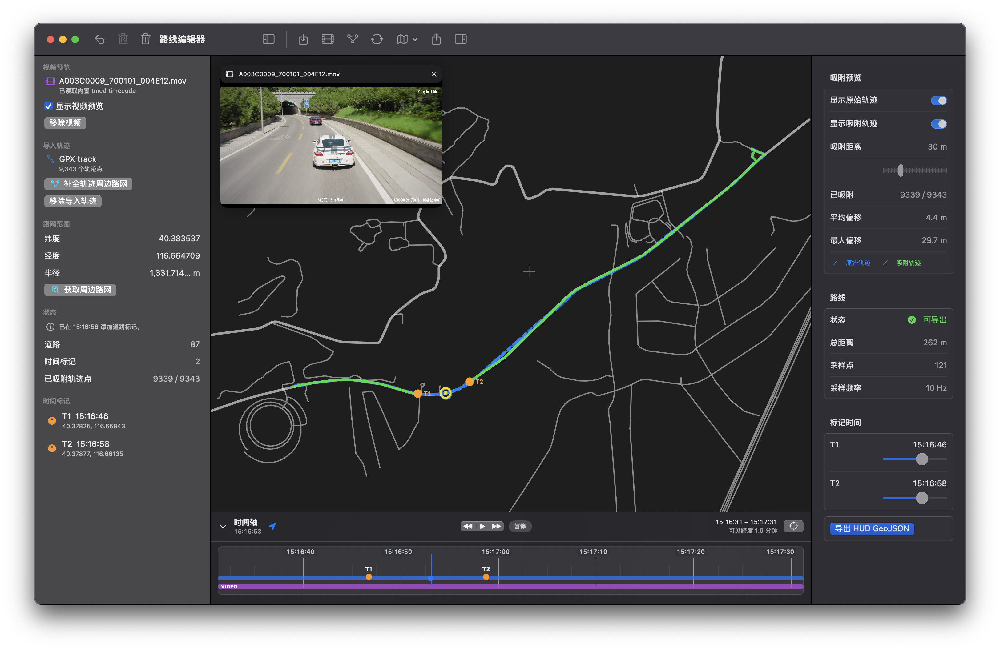

# HUD5 Overlay

一个基于 React + Vite 的赛车 HUD 叠加层工具，用于把车辆遥测、路线轨迹和视频素材同步播放，并导出可用于剪辑软件的透明 HUD 视频。


项目视觉方向参考 Forza Horizon 风格：速度表、进度/时间、右上角名次、小地图轨迹、玩家名称和海拔等信息都以固定 16:9 HUD 舞台渲染。

## 主要功能

- 加载遥测（`.csv` / `.json`）、路线（`.gpx` / `.geojson`）、视频（`.mp4` / `.mov` / `.webm` / `.m4v`）
- 共享时间轴同步所有素材，支持拖动轨道做 offset 对齐和 trim 裁剪
- 项目帧率 `24 / 30 / 48 / 60 / 120`，时间轴显示专业 timecode（`HH:MM:SS:FF`）
- 支持读取 MOV / MP4 内嵌 QuickTime `tmcd` timecode
- 小地图显示路线、方向、已行驶轨迹和比例尺，支持可调视野/俯视角/线宽
- 支持 WGS-84 / GCJ-02 / BD-09 坐标系，导入后统一转换为 WGS-84
- OSM 路网补全 + HMM/Viterbi 地图匹配道路吸附
- `km/h` / `MPH` 切换
- 拖拽调整 HUD 组件位置，布局持久化到 `localStorage`
- GPX G 力驱动的 cockpit shake 和 CSS 3D 头盔曲面效果
- Puppeteer + FFmpeg 导出透明 WebM / ProRes 视频
- 内置 HUD Route Lab：从 OSM 路网生成赛道、编辑路线、导出 GeoJSON
- OBD 长格式日志、RaceChrono Pro CSV 转换脚本

## 快速开始

```bash
# 安装依赖
npm install

# 启动开发服务器 → http://127.0.0.1:5173/
npm run dev
```

打开浏览器后可以直接拖入视频、遥测 CSV/JSON、GPX/GeoJSON 文件，也可以点击「加载示例数据」使用 `public/samples/` 里的示例。

### 常用命令

```bash
npm run dev         # 开发服务器
npm run build       # 类型检查 + 构建
npm run preview     # 本地预览构建产物（导出前需要）
npm run export      # 导出 HUD 帧/视频
```

## 使用指南

### 时间轴与 timecode

应用内部使用「本地当天零点后的秒数」作为共享时间轴。CSV 的 `t` 字段、GPX 的 `<time>`、视频内嵌的 `tmcd` timecode 都会映射到这条轴上。时间轴底部显示 GPX / CSV / VIDEO 三条素材轨道，可以拖动轨道调整 offset，让预览和导出使用同一套对齐关系。

GPX 示例数据的起始时间码按文件 ISO 时间映射到本地当天时间。例如 `2026-04-21T10:00:00.000Z` 在 `Asia/Shanghai` 会显示为 `18:00:00:00`。

每条素材轨道支持独立的 **trim（裁剪）**：拖拽素材左右边缘裁掉首尾不需要的段落，底层数据不变，仅影响播放和导出。

### 布局编辑

点击顶部工具栏的「编辑布局」后拖动 HUD 元素。布局偏移和预设保存在 `localStorage`（`hud5.layout.v1` / `hud5.presets.v1`）。点击「重置」恢复默认位置。

高级 HUD 设置（`hud5.settings.v1`）包括：

- 轨迹原始坐标系：`WGS-84`、`GCJ-02`、`BD-09`
- 路径吸附：HMM/Viterbi 地图匹配，可调最大吸附距离
- 小地图：可视半径、俯视角、道路线宽
- HUD 抖动：GPX G 力驱动的 cockpit shake 开关及强度（0–8）
- 头盔曲面：CSS 3D perspective 效果开关及强度（0–3）

### HUD Route Lab

原生 macOS 路线编辑器（`swift/HUDRouteLab`），提供 MapKit 原生地图渲染和 AppKit 交互体验。可从 OpenStreetMap 路网自动生成赛道、手动编辑路线点、导入 GPX/GeoJSON 轨迹和视频（含 `tmcd` timecode 提取），导出 GeoJSON 供 HUD 小地图使用。



预构建 `.app` 可在 [GitHub Releases](https://github.com/JHBOY-ha/track-hud-overlay/releases) 下载，无需编译。详见 [swift/README.md](swift/README.md)。

> 另有一个轻量 Web 版路线编辑器，运行 `npm run dev:route-lab` 后访问 `http://127.0.0.1:5174/route-lab.html`，支持从 OSM 路网生成赛道并导出 GeoJSON。

## 数据格式

### 遥测 CSV

至少需要包含 `t`（秒）和 `speed_kmh`（或 `speed`）：

| 字段                      | 必填 | 说明                          |
| ------------------------- | ---- | ----------------------------- |
| `t`                     | 是   | 本地当天零点后的秒数          |
| `speed_kmh` / `speed` | 是   | 车速，km/h                    |
| `rpm`                   | 否   | 发动机转速                    |
| `rpm_max`               | 否   | 转速表最大值                  |
| `gear`                  | 否   | 档位，数字 /`N` / `R`     |
| `throttle`              | 否   | 油门，`0`–`1`            |
| `brake`                 | 否   | 刹车，`0`–`1`            |
| `abs`                   | 否   | ABS，`1/0` / `true/false` |
| `tcs`                   | 否   | TCS 状态                      |
| `progress`              | 否   | 赛道进度，`0`–`1`        |
| `position_current`      | 否   | 当前名次                      |
| `position_total`        | 否   | 总参赛车辆数                  |

```csv
t,speed_kmh,rpm,rpm_max,gear,throttle,brake,abs,tcs,progress,position_current,position_total
64800.00,55.00,1883,6000,2,0.30,0,0,0,0.0000,5,12
64800.10,56.20,1940,6000,2,0.35,0,0,0,0.0010,5,12
```

### 遥测 JSON

支持数组或 `{ samples: [...] }` 对象，字段兼容 camelCase / snake_case：

```json
{
  "samples": [
    { "t": 0, "speedKmh": 55, "rpm": 1883, "progress": 0, "positionCurrent": 5, "positionTotal": 12 }
  ]
}
```

### 轨迹 GPX / GeoJSON

坐标默认按 WGS-84 处理。若来自 GCJ-02 / BD-09 来源，在高级设置中选择对应坐标系，应用会自动转换。

GeoJSON 图层通过 `properties.kind` 或 `properties.type` 分类：

- `driven` — 实际行驶轨迹
- `planned` — 计划路线
- `reference` — 背景参考线

GPX route → `planned`，普通 track → `driven`。

导入 GPX 时可在高级设置中开启轨迹点过滤：

- **最小距离**（米）：移除间距过近的连续点
- **最大间隔**（秒）：在时间间隔过长的相邻点之间打断路径

### GPX 路网补全

`scripts/enrich-gpx-with-osm.mjs` 从 GPX 轨迹范围下载 OSM 路网并输出 GeoJSON：

```bash
npm run enrich:gpx -- local/activity.gpx output
```

Web UI 中拖入 GPX 后点击工具栏「补全路网」也可触发，结果保存到 `output/` 并立即加载。

坐标系、道路类型等可配置：

```bash
node scripts/enrich-gpx-with-osm.mjs local/activity.gpx output --coord=gcj02
node scripts/enrich-gpx-with-osm.mjs local/activity.gpx output --highway=motorway,trunk,primary,secondary,tertiary
```

输出文件：

| 文件                      | 说明                                            |
| ------------------------- | ----------------------------------------------- |
| `*_enriched.geojson`    | 主轨迹 `driven` + 周边 OSM 道路 `reference` |
| `*_enriched.gpx`        | 原始 GPX + 最近 OSM 道路信息                    |
| `*_enriched_points.csv` | 每个轨迹点的最近道路、距离和标签                |
| `*_osm_bbox.osm`        | OSM bbox 缓存（传 `--refresh-osm` 重新下载）  |

## 数据转换

### OBD 日志转换

`scripts/convert-obd-log.mjs` 将 OBD recorder 长格式 CSV 转为项目遥测格式：

```bash
node scripts/convert-obd-log.mjs input.csv output.csv
node scripts/convert-obd-log.mjs input.csv output.csv --rate=10
node scripts/convert-obd-log.mjs input.csv output.csv --position-current=3 --position-total=12
```

若 `SECONDS` 是相对秒数，用 `--relative` 锚定到本地时间：

```bash
node scripts/convert-obd-log.mjs "2026-04-27 00-19-36.csv" output.csv --relative
node scripts/convert-obd-log.mjs input.csv output.csv --relative --start="2026-04-27 00:19:36"
```

> [!NOTE]
> OBD 日志有总行驶距离字段时，脚本自动归一化生成 `progress`。否则 `progress` 留空。

### RaceChrono Pro CSV

`scripts/convert-racechrono-csv.mjs` 将 RaceChrono Pro v10 的 GPS + OBD-II + IMU CSV 转为 telemetry CSV + GPX：

```bash
node scripts/convert-racechrono-csv.mjs local/session_xxx.csv \
  --vehicle="BMW E63 LCI 630i 6AT"
# → local/session_xxx.hud.csv  (telemetry)
# → local/session_xxx.gpx      (driven 轨迹)
```

推导逻辑：

- **档位**：用传动比表 + 轮胎周长，由 `rpm/speed` 拟合。`--vehicle=` 指定车型，`--ratios=` / `--tire=` 自定义
- **油门**：自动估出怠速基线并归一化（`--throttle-idle=auto`）
- **刹车**：从纵向加速度 EMA 平滑后映射到 0–1，油门开启时强制归零
- **GPX**：从 GPS 行抽取坐标写为 GPX 1.1
- **速度源**：默认 GPS，可选 `obd` 或 `calc`

## 导出透明 HUD

Puppeteer 驱动浏览器逐帧截图，FFmpeg 合成视频。

```bash
# 1. 构建并启动预览
npm run build
npm run preview

# 2. 导出
node scripts/export-frames.mjs \
  --telemetry /samples/telemetry.csv \
  --track /samples/track.gpx \
  --duration 3600 \
  --range-start 3888000 --range-end 3891600 \
  --progress-start 64800 --progress-end 64860 \
  --fps 60 --width 1920 --height 1080 \
  --out out/hud.webm
```

`--duration`、`--range-start`、`--range-end` 使用项目帧编号。高级 HUD 设置（路网吸附、小地图、抖动、曲面）需显式传入：

```bash
--snap-to-roads 1 --snap-max-dist 5 \
--minimap-radius 50 --minimap-tilt 70 --minimap-stroke 10 \
--hud-shake 1 --hud-shake-intensity 1 \
--hud-curvature 1 --hud-curvature-intensity 1
```

输出格式：

| 扩展名              | 格式                            |
| ------------------- | ------------------------------- |
| `.webm`           | VP9 透明视频                    |
| `.mov` / `.mp4` | ProRes 4444 透明视频 + timecode |
| 其他                | PNG 序列 →`out/frames`       |

> [!IMPORTANT]
> 导出视频需要本机安装 `ffmpeg` 并在 `PATH` 中。

## URL 参数

应用支持通过 URL 参数加载数据，便于导出和自动化：

```text
/?telemetry=/samples/telemetry.csv&track=/samples/track.gpx&player=ANNA&unit=kmh&t=64800
```

| 参数                                                    | 说明                                         |
| ------------------------------------------------------- | -------------------------------------------- |
| `telemetry`                                           | 遥测文件 URL                                 |
| `track`                                               | GPX / GeoJSON 文件 URL                       |
| `player`                                              | 玩家名称                                     |
| `unit`                                                | `kmh` / `mph`                            |
| `coord`                                               | 轨迹坐标系：`wgs84` / `gcj02` / `bd09` |
| `t`                                                   | 初始时间（本地当天零点后秒数）               |
| `rangeStart` / `rangeEnd`                           | 选区起止（秒）                               |
| `progressStart` / `progressEnd`                     | 进度起止（秒）                               |
| `telemetryOffset` / `trackOffset` / `videoOffset` | 素材轨道偏移（秒）                           |
| `snapToRoads`                                         | 路网吸附：`1` / `0`                      |
| `snapMaxDistM`                                        | 吸附最大距离（米）                           |
| `minimapViewRadiusM`                                  | 小地图可视半径（米）                         |
| `minimapTiltDeg`                                      | 小地图俯视角（度）                           |
| `minimapStrokeWidth`                                  | 小地图线宽（px）                             |
| `hudShake` / `hudShakeIntensity`                    | cockpit shake 开关 / 强度（0–8）            |
| `hudCurvature` / `hudCurvatureIntensity`            | 头盔曲面开关 / 强度（0–3）                  |
| `exporter=1`                                          | 透明导出模式，隐藏控制栏                     |

## 项目结构

```text
src/
  App.tsx                 # 应用外壳、文件加载、视频同步、工具栏和时间轴
  routeLabMain.tsx        # HUD Route Lab 入口
  hud/                    # HUD 组件
    Hud.tsx               # HUD 根组件（抖动、曲面、角标）
    Minimap.tsx           # 小地图
    Speedometer.tsx       # 速度表
    TopLeftStatus.tsx     # 左上：时间/进度/海拔
    TopRightPosition.tsx  # 右上：名次/玩家名
    Draggable.tsx         # 拖拽编辑
    hudShake.ts           # GPX G 力驱动的 cockpit shake
    helmetCurve.ts        # CSS 3D 头盔曲面变换
    minimapViewport.ts    # 小地图视口常量与透视变换
  generator/              # Route Lab 路线生成器
    GpxGenerator.tsx      # 编辑器 UI
    routeCore.ts          # OSM 路网路线生成核心
  data/                   # 遥测和轨迹解析
  playback/               # 播放状态、布局状态和 rAF 播放循环
  util/                   # 单位换算、坐标系转换、投影和导出 URL 工具
route-lab.html            # Route Lab HTML 入口
scripts/
  convert-obd-log.mjs         # OBD 长格式日志转换
  convert-racechrono-csv.mjs  # RaceChrono Pro CSV → telemetry + GPX
  csv-to-gpx-50hz.mjs         # 高频 CSV 转 GPX 轨迹
  enrich-gpx-with-osm.mjs     # GPX 路网补全和 OSM 匹配
  export-frames.mjs           # 透明 HUD 导出
  generate-sample.mjs         # 生成示例数据
public/samples/           # 示例 telemetry 和 track
design-ref/               # 视觉参考图
swift/                    # 原生 macOS Swift 移植（详见 swift/README.md）
```

## 技术栈

- React 18 + TypeScript
- Vite
- Zustand（状态管理）
- Papa Parse（CSV 解析）
- `@tmcw/togeojson`（GPX 解析）
- Puppeteer（导出截图）
- FFmpeg（视频合成）
